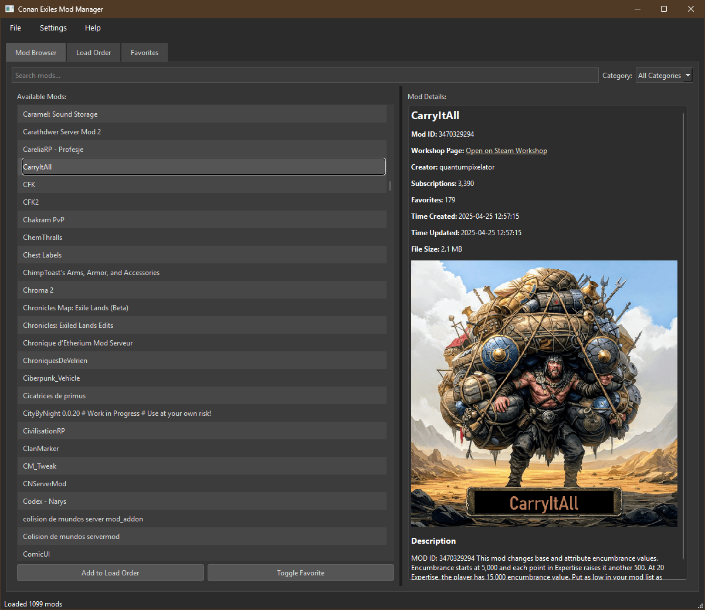

# Conan Exiles Mod Manager

A simple, friendly desktop app to browse Conan Exiles Steam Workshop mods, save favorites, and build optimized load orders.

## Getting started

- Developed in Python 3.14.0
- Create a virtual environment for your workspace.
- Install dependencies:

```powershell
pip install -r requirements.txt
```

- Launch the app:

```powershell
python main.pyw
```

## What you'll see

- A Mod Browser with a searchable list of mods.
- Click a mod to see full details and a preview image in the Details panel.
- Add favorites for quick access and save/load optimized load order presets.

## Tips

- You will need a free Steam Web API key: [Get one from Steam](https://steamcommunity.com/dev/apikey).
- Set your Steam Web API key in Settings.
- Use File → Update Mod List to fetch and/or update the latest mods from the Steam Workshop.
- Data is stored in `ce_mm.db` in the project folder. The db is created on first app run.

## Screenshot



## License

This project is available under the MIT License. See the `LICENSE` file for details.
